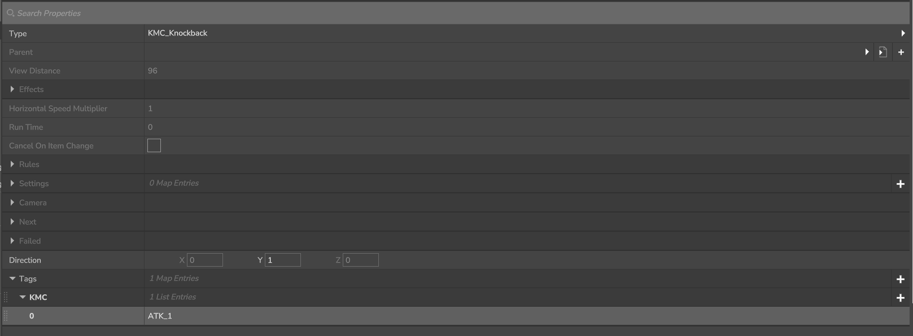
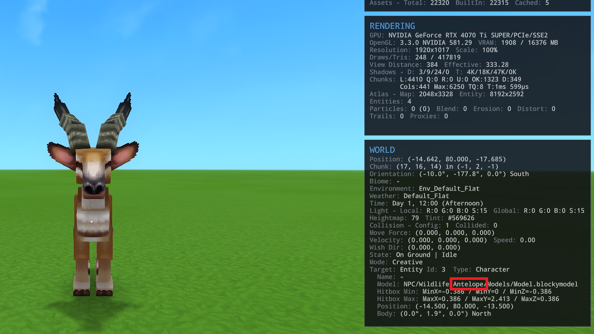

# Kweebec May Cry (KMC) Interactions
**KMC Interactions** is an interaction library for Hytale. Its being developed for my mod _Kweebec May Cry_, but is designed to be as modular and reusable as possible.

This mod adds several new interactions:
- Knockback: allows to add impulse in a given direction relative to the player
- Parry: allows an entity to parry while attacking
- Slowfall: slows the fall of the entity it targets

## Installation Guide
  1. Download the jar from the releases 
  2. Place the jar in the Hytale Mods folder:
  3.  Enable the mod in the world config

## Quick Start Guide

**I assume you have some experience with modding using the Asset Editor so I won't explain the whole process of adding and changing interactions.**

To find any of the interactions quickly using the Asset Editor search for `KMC` all the interactions in this mod should appear.

## Interactions
### Parry Interaction

Allows the player to parry by attacking (is there a cooler way to parry XD)

| Parameters                        | Description                                                    |
| --------------------------------- | -------------------------------------------------------------- |
| Duration                          | Duration in milliseconds the parry window should be active for |
| (Optional) Success Sound Event ID | The sound that should be played if the parry is sucessfull     |

### Slowfall

Modifies the target entity falling speed (perfect for some aerial combos)

| Parameters | Description                                                    |
| ---------- | -------------------------------------------------------------- |
| Duration   | Duration in milliseconds the fall speed should be modified for |
| Fall Speed | The value of speed to set (Positive = UP; Negative = DOWN)     |
| Delay      | Duration in milliseconds to wait before applying the slowfall  |

> [!IMPORTANT]
> While testing this interaction was placed in parallel to the knockback interaction. If it's placed in another location it may have unintended side effects

### Knockback

> [!WARNING] 
> This is currently the most complex interactions and the main focus of the mod as such expect some bugs.

This interaction allows the attacker to apply a "knockback" force in a direction relative to itself. Unlike the default DamageEntityInteraction knockback, this system supports tag-based force values per entity. This allows different attacks to apply different knockback behaviors without being limited to a single force value.

#### Interaction configuration
Bellow are the parameters that can be set in the Asset Editor

| Parameter | Description                                                                  |
| --------- | ---------------------------------------------------------------------------- |
| Direction | Direction relative to the owner of the interaction the force will be applied |

**To use a non-default force**:
1. Add a key named `"KMC"` in the interaction.
2. Add a new entry under `"KMC"` matching the name of a configured tag.
When the interaction runs, it will look for the force value associated with that tag.

If no custom tag is defined in the configuration file, the interaction will fall back to the `"default"` tag force value.

#### Configuration of force values and tags
This interaction uses a configuration file to apply forces associated with a given tag. This file will be created the first time the mod is launched in a new world and will be place in that world's mod folder inside a folder named KMC.

This configuration can be changed manually by editing the config file or by using the following commands:

| Command        | Alias   | Description                                                                | Parameters                                                                                                                                   |
| -------------- | ------- | -------------------------------------------------------------------------- | -------------------------------------------------------------------------------------------------------------------------------------------- |
| /kmc_addTag    | /kmc_AT | Adds a new tag to all entities                                             | \<tag\> : tag name (optional)\<force\> : initial force value                                                                              |
| /kmc_editForce | /kmc_EF | Allows to edit the force value of a given tag in a given entity            | \<modelID\> : the entity that will have it's force edited \<force\> :  new force value (optional)\<tag\> : the tag to change the value |
| /kmc_getForces | /kmc_GF | Shows all the forces associated with a given entity or from a specific tag | \<modelID\> : the entity that will have it's force edited (optional)\<tag\> : check for only a single tag                                 |
| /fe            |    -    | Opens the force editor GUI                                                 | (None)                                                                                                                                       |

> [!IMPORTANT] 
> The `modelID` corresponds exactly to the entity’s Model ID.  
> You can retrieve it in-game by pressing **F7 twice**, then checking:
>	`Target → Model`

#### Limitations
If the force applied is in the XZ plane it can be a little finicky and hard to get the correct values for the direction.

### Example - Adding a new Tag and editing its value

1. `/kmc_addTag UP 50` this will add the UP tag with value of 50.0 to every entity present in the configuration file
2. `/kmc_editForce Antelope 30 UP` this will change the force associated with the `UP` tag when an `Antelope` is hit
3. Add a new `KMC_Knockback` interaction to your weapon of choice in parallel to the damage interaction 
4. Add the key `KMC` to that interaction and then the `UP` entry
5. Attack the `Antelope` and... 

## is that a bird... is that a plane... NO IT'S AN ANTELOPE
